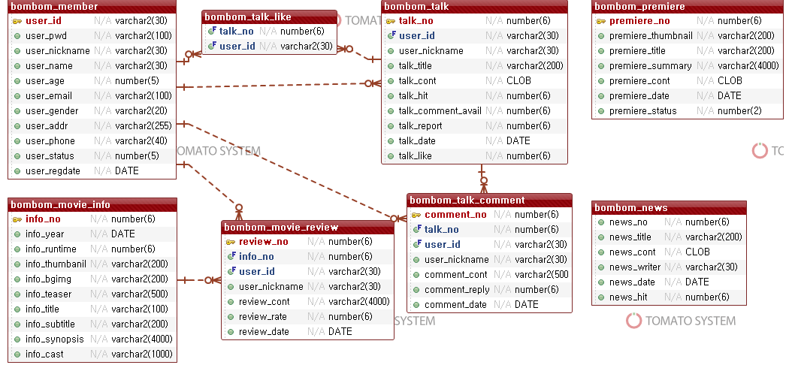

# 봄봄 : 이 영화 봄?봄!
### 영화 종합커뮤니티 : 봄봄

 

 

'봄봄(이 영화 봄?봄!)'은 영화를 주제로 이용자 간 소통하는 영화커뮤니티 사이트입니다.

단순한 커뮤니티 기능뿐만 아니라 상영 중인 영화 정보, 시사회, 극장 주변맛집 등 영화와 관련된 정보를 함께 제공합니다.

 

## 1. 개요

- 🕒 프로젝트 기간 : 2021.12.27 ~ 2022.1.14 (3주)

- 🙋‍♂️ 팀원 : 안승욱, 최진경, 신현욱, 허민회, 송정현

- 🔨 Stack
    - Language : Java 1.8

    - Database : Oracle 18c

    - Library : **Spring Framework**, MyBatis, JSP

    - Server : Apache Tomcat 9.0

    - HTML5, CSS3, JavaScript, jQuery

    - IDE : Eclipse, Visual Studio Code

    - 협업 툴 : Git, Github, Google Docs

 

## 2. 주요 기능

- 봄봄소식 : 봄봄 사이트 공지사항 및 영화 관련 소식을 볼 수 있는 페이지

- 영화수다 : 회원이 작성한 글을 볼 수 있는 페이지, 회원일 경우 게시글 작성, 수정, 삭제, 좋아요, 댓글 사용 가능

- 영화정보 : 상영 중인 영화 정보를 조회, 회원일 경우 리뷰 작성 가능

- 극장맛집 : 네이버, 카카오에서 제공하는 API를 활용하여 플래그십 영화관 주변 맛집을 소개하는 페이지

- 시사회 : 현재 진행중인 시사회를 볼 수 있는 페이지

 

## 3. ERD

봄봄 DB 테이블은 8개로 구성되어있으며, ERD는 다음과 같습니다.

 

ERD보기
 
 

 
